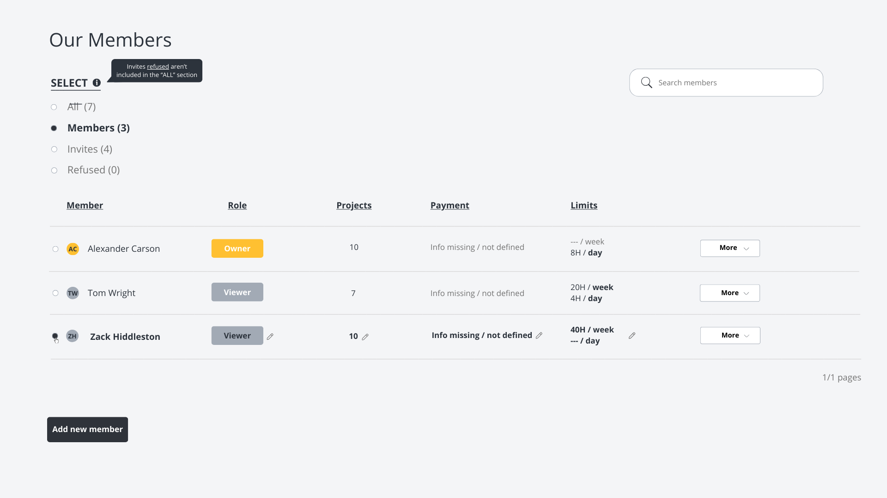

# RemoteCrew React Challenge
The goal of this exercise is to assess candidates' frontend development skills with React. 

As you go through the pair programming session, it's helpful to share what you're thinking as it helps us understand your strategy and makes it easier to provide hints if/when necessary.

There are multiple correct ways to implement a solution for this challenge. Done is better than perfect.

## Prerequisites
- Git
- npm

## Project Setup
Clone the project
```
git clone git@github.com: ///alterar para o projeto 
```

Install the dependencies
```
npm install
```

Start the server
```
npm run serve
```

Check the project running on localhost: 
[http://localhost:8080/](http://localhost:8080/)

#### Please set up your working environment before the interview (working server, npm dependencies), so we don't spend time installing anything.

## Project Description
The feature you need to implement is allowing **Organization Admins** to check information regarding the **Members** of their teams.



The challenge proposed is to implement the **Members** tab just like you see it on the image above. Feel free to add the **Invites** tab as disabled, so it can't be navigated to.

The data for the **Members** belonging to this **Organization** should be fetched from the following url address:
[https://run.mocky.io/v3/3d8c4e8b-86b0-457d-937d-854fe02f0949](https://run.mocky.io/v3/3d8c4e8b-86b0-457d-937d-854fe02f0949)

Here's what the response should look like:
```
{
  "count": 3,
  "members": [
    {
      "id": 1,
      "name": "Alexander Carson",
      "role": "Owner",
      "projects": 10,
      "payment": null,
      "limits": {
        "weekly": null,
        "daily": 8
      },
      "time_tracking": "enabled"
    },
    {
      "id": 2,
      "name": "Tom Wright",
      "role": "Viewer",
      "projects": 7,
      "payment": null,
      "limits": {
        "weekly": 20,
        "daily": 4
      },
      "time_tracking": "enabled"
    },
    {
      "id": 3,
      "name": "Zack Hiddleston",
      "role": "Viewer",
      "projects": 10,
      "payment": null,
      "limits": {
        "weekly": 40,
        "daily": null
      },
      "time_tracking": "enabled"
    }
  ]
}
```

## Requirements
**What we're expecting:**
- UI matching the image above
- Search functionality (*Search Members* by name)
- Filtering
  - *ROLE* field options: All Roles | Owner | Viewer
  - *TIME TRACKING* field options: All Time Tracking | Enabled | Disabled
- Unit tests

**What we're NOT expecting:**
- Any of the buttons or clickable elements to work
- Mobile responsive solution

## Stack
We've configured the project using the following tech stack:
- [@vitejs/plugin-react](https://github.com/vitejs/vite-plugin-react/blob/main/packages/plugin-react/README.md)
- [@vitejs/plugin-react-swc](https://github.com/vitejs/vite-plugin-react-swc)

Please use these technologies for the challenge. Where we don't specify any tool (ex: fetching external resources) feel free to use what you're most comfortable with. 

## Submission
Please clone the repository and create a private repository on your own account. Then, create a new branch and submit a Pull Request with your proposed solution. Make sure to add and request review on the PR.

## Evaluation Criteria
We'll be looking at the following criteria when assessing candidate submissions:
- Project architecture
- Code simplicity and clarity
- Git history, including comments in the PR

**Good luck!**
