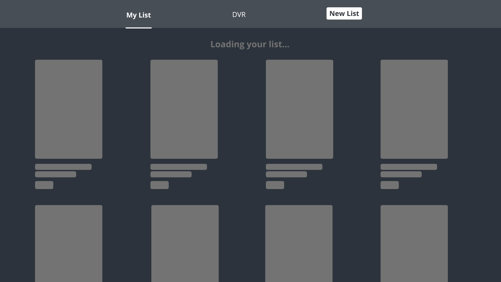

# RemoteCrew React Challenge 2
The goal of this exercise is to assess candidates' frontend development skills with React. 

There are multiple correct ways to implement a solution for this challenge. Done is better than perfect.

## Prerequisites
- Git
- npm 

## Project Setup
Clone the project
```
git clone git@github.com
```

Install the dependencies
```
npm install
```

Start the server
```
npm run serve
```

Check the project running on localhost: 
[http://localhost:8080/](http://localhost:8080/)

#### Please set up your working environment before the interview (working server, npm dependencies), so we don't spend time installing anything.

## Project Description
You need to develop a simple application which manages movie and tv show lists. In this app should be possible - view lists, filter list.
Use this API to create the movie and tv show list, https://developers.themoviedb.org/3/getting-started/authentication, you should create an account in the themoviedb website and create list to test and implement in your project.

 


## Requirements
**What we're expecting:**
- UI matching the image above
- Create lists.
- Filtering for movies and TV shows, with two separate pages for each (use the design example for both). You should be able to switch between them using the navigation bar.
- Create a loading page.    

**What we're NOT expecting:**
- Mobile responsive solution

## Stack
* Use JavaScript (ES6+)
* Use React
* Code must be covered with unit-tests (at least business logic)
* Use any design library for UI 
* Use any other libraries and frameworks to speed up development

Please use these technologies for the challenge. Where we don't specify any tool (ex: fetching external resources) feel free to use what you're most comfortable with. 

## Submission
Please clone the repository and create a private repository on your own account. Then, create a new branch and submit a Pull Request with your proposed solution. Make sure to add and request review on the PR.

## Evaluation Criteria
We'll be looking at the following criteria when assessing candidate submissions:
- Project architecture
- Code simplicity and clarity
- Git history, including comments in the PR

**Good luck!**
